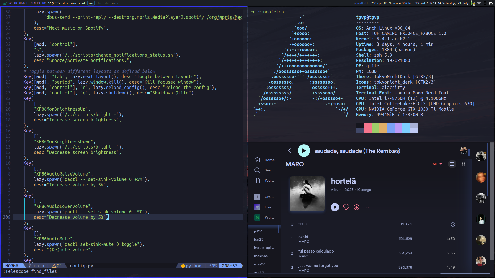

# dotfiles

Here, u can find my personal dotfiles and scripts that I use in a daily basis.

Lots of help from [zero](https://github.com/zer0-5) and, for qtile, a huge thanks to [dt](https://www.youtube.com/@DistroTube).

Some previews:

